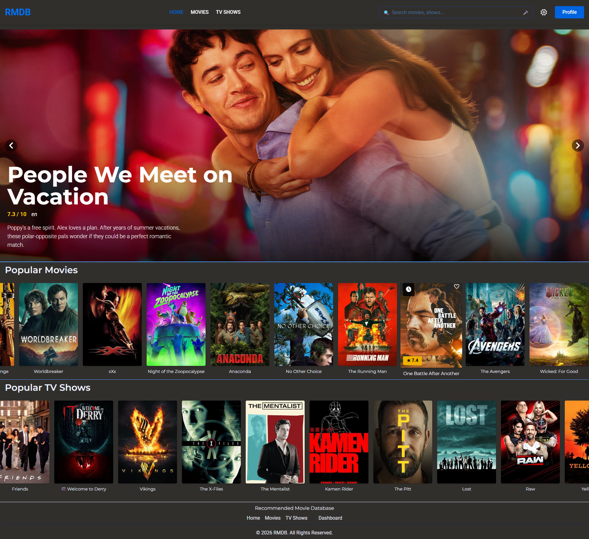
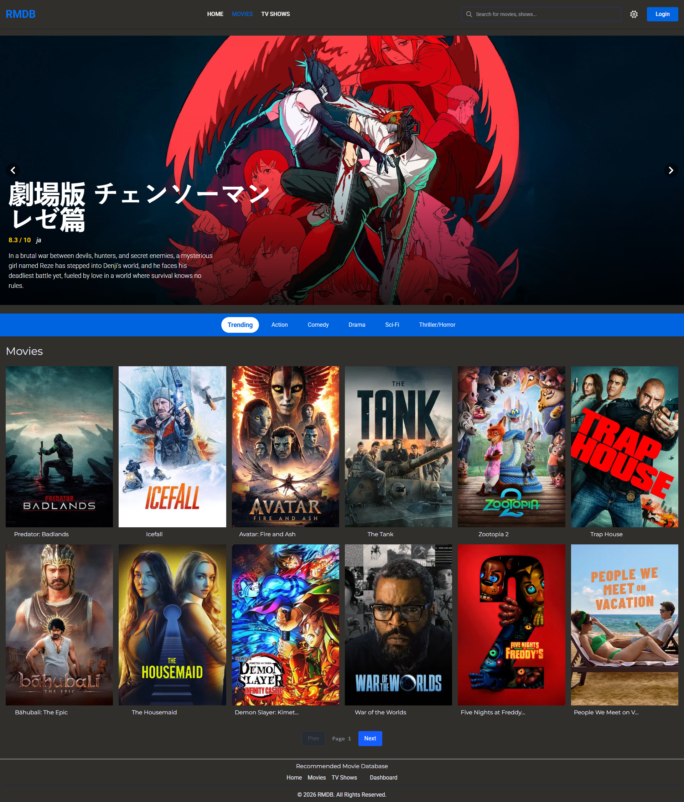
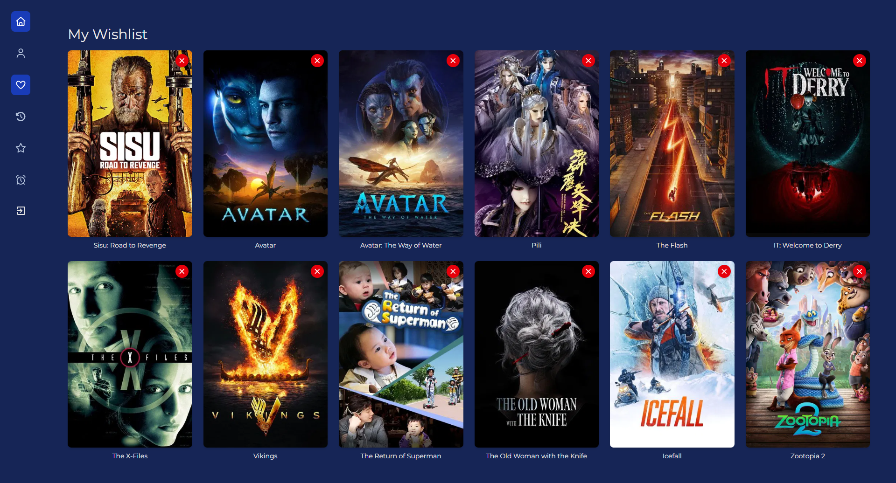
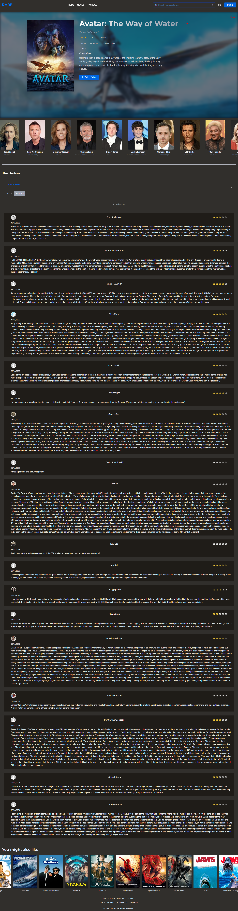

# MovieVerse - Movie Discovery & Recommendation Platform

A full-stack movie discovery and recommendation platform built with React, Express, and MongoDB. Features AI-powered recommendations, user authentication, watchlists, reviews, and an admin dashboard.

## Tech Stack

### Frontend
- **React 19** with Vite
- **TailwindCSS 4** for styling
- **Framer Motion** for animations
- **React Router DOM** for navigation
- **Axios** for API calls
- **TensorFlow.js** for client-side ML

### Backend
- **Express.js** (ES Modules)
- **MongoDB** with Mongoose
- **JWT** for authentication
- **Node-Cron** for scheduled jobs
- **Google Gemini AI** for smart search
- **TensorFlow.js** for recommendations
- **Cloudinary** for image storage

## Features

- **Movie & TV Show Discovery** - Browse trending, top-rated, now playing, upcoming
- **AI-Powered Recommendations** - Personalized suggestions using TensorFlow.js
- **Smart Search** - AI-powered search with Gemini
- **User Authentication** - Register, login, password reset
- **Watchlist & Watch Later** - Save movies to watch
- **Review System** - Rate and review movies/shows
- **Watch History** - Track what you've watched
- **Admin Dashboard** - Manage users, content, reviews, support tickets
- **Notifications** - Email reminders for new releases
- **Responsive Design** - Works on desktop and mobile

## Screenshots

| Home Page | Movies |
|-----------|--------|
|  |  |

| Wishlist | Details |
|----------|---------|
|  |  |

## Project Structure

```
MovieVerse/
├── client/                 # React frontend
│   ├── src/
│   │   ├── admin/         # Admin dashboard components
│   │   ├── components/    # Shared components
│   │   ├── config/        # Configuration files
│   │   ├── context/       # React contexts
│   │   ├── dashboard/     # User dashboard pages
│   │   ├── features/      # Feature modules
│   │   ├── home/          # Home page components
│   │   ├── hooks/         # Custom React hooks
│   │   ├── layouts/       # Layout components
│   │   ├── movies/        # Movie-specific components
│   │   ├── pages/         # Page components
│   │   ├── services/      # API services
│   │   ├── tvshows/       # TV show components
│   │   ├── ui/            # UI components
│   │   └── utils/         # Utility functions
│   └── public/            # Static assets
├── server/                 # Express backend
│   ├── src/
│   │   ├── config/        # Configuration
│   │   ├── controllers/    # Route controllers
│   │   ├── database/      # Database connection
│   │   ├── jobs/          # Cron jobs
│   │   ├── middlewares/   # Express middlewares
│   │   ├── models/        # Mongoose models
│   │   ├── routes/        # API routes
│   │   ├── services/      # Business logic
│   │   └── utils/         # Utility functions
│   └── models/            # ML model files
├── vercel.json            # Vercel deployment config
├── render.yaml            # Render deployment config
└── README.md
```

## Getting Started

### Prerequisites

- Node.js 18+
- MongoDB (local or Atlas)
- TMDB API Key (for movie data)
- Cloudinary Account (for image storage)

### Installation

1. **Clone the repository**
   ```bash
   git clone https://github.com/shikeshjayan/MovieVerse.git
   cd MovieVerse
   ```

2. **Set up environment variables**

   Create `.env` in root:
   ```env
   # Server (.env)
   MONGO_URL=your_mongodb_connection_string
   JWT_SECRET=your_jwt_secret
   JWT_EXPIRES_IN=7d
   EMAIL_USER=your_email
   EMAIL_PASS=your_email_password
   GEMINI_API_KEY=your_gemini_api_key
   CLOUDINARY_CLOUD_NAME=your_cloud_name
   CLOUDINARY_API_KEY=your_api_key
   CLOUDINARY_API_SECRET=your_api_secret
   TMDB_API_KEY=your_tmdb_api_key
   ```

   Create `client/.env`:
   ```env
   VITE_API_URL=http://localhost:5000/api
   ```

3. **Install dependencies**

   ```bash
   # Install server dependencies
   cd server && npm install

   # Install client dependencies
   cd ../client && npm install
   ```

### Running Locally

**Start the backend:**
```bash
cd server
npm run dev
```

**Start the frontend:**
```bash
cd client
npm run dev
```

The app will be available at `http://localhost:5173`

## API Endpoints

> **Base URL:** `https://your-backend-url.com/api`
> 
> **Authentication:** Most endpoints require JWT token in header: `Authorization: Bearer <token>`
> 
> **Content-Type:** `application/json`

### Authentication

| Method | Endpoint | Description | Auth Required |
|--------|----------|-------------|---------------|
| POST | `/auth/register` | Register new user | No |
| POST | `/auth/login` | Login user | No |
| POST | `/auth/forgot-password` | Request password reset | No |
| POST | `/auth/reset-password/:token` | Reset password | No |
| POST | `/auth/logout` | Logout user | Yes |
| GET | `/auth/me` | Get current user | Yes |

#### Register
```bash
POST /api/auth/register
Content-Type: application/json

{
  "name": "John Doe",
  "email": "john@example.com",
  "password": "password123"
}
```

#### Login
```bash
POST /api/auth/login
Content-Type: application/json

{
  "email": "john@example.com",
  "password": "password123"
}

# Response
{
  "token": "eyJhbGciOiJIUzI1...",
  "user": { "id": "...", "name": "John", "email": "...", "role": "user" }
}
```

### Home & Discovery

| Method | Endpoint | Description | Auth Required |
|--------|----------|-------------|---------------|
| GET | `/home` | Get homepage data (trending, top-rated, etc.) | No |
| GET | `/trending` | Get trending media | No |
| GET | `/movies` | Get movies list | No |
| GET | `/shows` | Get TV shows list | No |
| GET | `/movies/:id` | Get movie details | No |
| GET | `/shows/:id` | Get TV show details | No |
| GET | `/movies/:id/similar` | Get similar movies | No |
| GET | `/shows/:id/similar` | Get similar TV shows | No |

#### Query Parameters (Movies/Shows)
| Parameter | Type | Description | Default |
|-----------|------|-------------|---------|
| `page` | number | Page number | 1 |
| `limit` | number | Items per page | 20 |
| `sort` | string | Sort field (popularity, vote_average, release_date) | popularity |
| `genre` | number | Filter by genre ID | - |

#### Example
```bash
GET /api/movies?page=1&limit=20&sort=vote_average&genre=28
```

### User Management

| Method | Endpoint | Description | Auth Required |
|--------|----------|-------------|---------------|
| GET | `/user/profile` | Get user profile | Yes |
| PUT | `/user/profile` | Update profile | Yes |
| PUT | `/user/password` | Change password | Yes |
| DELETE | `/user/account` | Delete account | Yes |

#### Update Profile
```bash
PUT /api/user/profile
Authorization: Bearer <token>
Content-Type: application/json

{
  "name": "John Updated",
  "avatar": "https://...",
  "preferredGenres": [28, 12, 878]
}
```

### Wishlist

| Method | Endpoint | Description | Auth Required |
|--------|----------|-------------|---------------|
| GET | `/user/wishlist` | Get all wishlist items | Yes |
| POST | `/user/wishlist` | Add to wishlist | Yes |
| DELETE | `/user/wishlist/:mediaId` | Remove from wishlist | Yes |

#### Add to Wishlist
```bash
POST /api/user/wishlist
Authorization: Bearer <token>
Content-Type: application/json

{
  "mediaId": 550,
  "mediaType": "movie",
  "title": "Fight Club",
  "posterPath": "/pB8BM7pdSp6B6Ih7QZ4DrQ3PmJK.jpg"
}

# Response
{
  "success": true,
  "wishlist": [...]
}
```

### Watch Later

| Method | Endpoint | Description | Auth Required |
|--------|----------|-------------|---------------|
| GET | `/user/watchlater` | Get watch later list | Yes |
| POST | `/user/watchlater` | Add to watch later | Yes |
| DELETE | `/user/watchlater/:mediaId` | Remove from watch later | Yes |

### Watch History

| Method | Endpoint | Description | Auth Required |
|--------|----------|-------------|---------------|
| GET | `/user/history` | Get watch history | Yes |
| POST | `/user/history` | Add to history | Yes |
| DELETE | `/user/history` | Clear history | Yes |
| DELETE | `/user/history/:mediaId` | Remove single item | Yes |

#### Add to History
```bash
POST /api/user/history
Authorization: Bearer <token>
Content-Type: application/json

{
  "mediaId": 550,
  "mediaType": "movie",
  "title": "Fight Club",
  "posterPath": "/pB8BM7pdSp6B6Ih7QZ4DrQ3PmJK.jpg",
  "watchedAt": "2024-01-15T10:30:00Z"
}
```

### Reviews

| Method | Endpoint | Description | Auth Required |
|--------|----------|-------------|---------------|
| GET | `/reviews/:mediaId` | Get reviews for media | No |
| POST | `/reviews` | Add review | Yes |
| PUT | `/reviews/:id` | Update own review | Yes |
| DELETE | `/reviews/:id` | Delete review | Yes (owner/admin) |

#### Add Review
```bash
POST /api/reviews
Authorization: Bearer <token>
Content-Type: application/json

{
  "mediaId": 550,
  "mediaType": "movie",
  "rating": 8.5,
  "comment": "Amazing film! The twist at the end..."
}

# Response
{
  "success": true,
  "review": {
    "_id": "...",
    "user": { "id": "...", "name": "John" },
    "rating": 8.5,
    "comment": "Amazing film!",
    "createdAt": "2024-01-15T10:30:00Z"
  }
}
```

### Recommendations

| Method | Endpoint | Description | Auth Required |
|--------|----------|-------------|---------------|
| GET | `/recommendations` | Get personalized recommendations | Yes |
| GET | `/recommendations/genre/:genreId` | Get genre-based recommendations | No |

#### Example
```bash
GET /api/recommendations?limit=20
Authorization: Bearer <token>

# Response
{
  "success": true,
  "recommendations": [
    {
      "_id": "...",
      "tmdbId": 550,
      "title": "Fight Club",
      "posterPath": "/pB8BM7...",
      "mediaType": "movie",
      "score": 0.95
    }
  ]
}
```

### Search

| Method | Endpoint | Description | Auth Required |
|--------|----------|-------------|---------------|
| GET | `/search` | Standard search | No |
| GET | `/smart-search` | AI-powered search (Gemini) | No |

#### Standard Search
```bash
GET /api/search?query=batman&mediaType=movie

# Response
{
  "success": true,
  "results": [
    {
      "tmdbId": 155,
      "title": "The Dark Knight",
      "mediaType": "movie",
      "posterPath": "/qJ2tW6WMUDux911r6m7haRef0WH.jpg"
    }
  ],
  "totalResults": 45,
  "page": 1,
  "totalPages": 3
}
```

#### Smart Search (AI)
```bash
GET /api/smart-search?q=scary+halloween+movies

# Response
{
  "success": true,
  "results": [
    {
      "title": "Halloween",
      "year": 1978,
      "type": "movie",
      "reason": "Perfect scary horror film for Halloween"
    }
  ]
}
```

### Admin

| Method | Endpoint | Description | Auth Required |
|--------|----------|-------------|---------------|
| GET | `/admin/users` | Get all users | Admin |
| GET | `/admin/users/:id` | Get user by ID | Admin |
| PUT | `/admin/users/:id` | Update user | Admin |
| DELETE | `/admin/users/:id` | Delete user | Admin |
| GET | `/admin/media` | Get all media | Admin |
| PUT | `/admin/media/:id` | Update media | Admin |
| DELETE | `/admin/media/:id` | Delete media | Admin |
| GET | `/admin/reviews` | Get all reviews | Admin |
| DELETE | `/admin/reviews/:id` | Delete review | Admin |
| GET | `/admin/support` | Get support tickets | Admin |
| PUT | `/admin/support/:id` | Update ticket | Admin |
| GET | `/admin/notifications` | Get notifications | Admin |
| POST | `/admin/notifications` | Send notification | Admin |

#### Admin Response Format
```bash
GET /api/admin/users?page=1&limit=10
Authorization: Bearer <admin-token>

# Response
{
  "success": true,
  "users": [
    {
      "_id": "...",
      "name": "John",
      "email": "john@example.com",
      "role": "user",
      "isActive": true,
      "createdAt": "2024-01-01T00:00:00Z"
    }
  ],
  "total": 150,
  "page": 1,
  "totalPages": 15
}
```

### Error Responses

All endpoints return consistent error formats:

```json
{
  "success": false,
  "message": "Error description"
}
```

#### Common Status Codes
| Code | Description |
|------|-------------|
| 200 | Success |
| 201 | Created |
| 400 | Bad Request |
| 401 | Unauthorized |
| 403 | Forbidden |
| 404 | Not Found |
| 500 | Server Error |

## AI/ML Implementation

### TensorFlow.js - Personalized Recommendations

The platform uses **Hybrid Neural Collaborative Filtering** to generate personalized movie and TV show recommendations.

#### How It Works

1. **Data Collection** - Collects user interaction data from multiple sources:
   - Watch history (what users watched)
   - Wishlist (what users want to watch)
   - Watch Later (saved for later)
   - Reviews (ratings and feedback)

2. **Feature Engineering**:
   - Genre encoding (one-hot encoding for 20 genres)
   - Release year normalization
   - Popularity scoring
   - User-item interaction scoring

3. **Neural Network Architecture**:
   - User embeddings (latent factors)
   - Item embeddings (latent factors)
   - Genre features
   - Combined with dense layers
   - Output: Predicted rating/preference score

4. **Recommendation Generation**:
   - Builds user-item interaction matrix
   - Trains neural network on interactions
   - Predicts scores for unwatched content
   - Returns top-N personalized recommendations

#### Key Files

- `server/src/services/tfRecommend.js` - Main recommendation engine
- `server/src/utils/scoreWeights.js` - Interaction weight configuration
- `server/src/utils/tfConfig.js` - TensorFlow configuration
- `server/src/jobs/trainJob.js` - Scheduled training job

#### Usage

Recommendations are generated automatically when users visit the recommendations page. The system uses cached models for performance.

```javascript
// API endpoint
GET /api/recommendations?limit=20
```

### Google Gemini AI - Smart Search

The platform uses **Google Gemini 2.5 Flash** for natural language understanding in search.

#### How It Works

1. **User Query Processing**:
   - Takes natural language input (e.g., "scary movies about ghosts")
   - Understands intent: mood, genre, theme, plot, actors

2. **AI Interpretation**:
   - Gemini analyzes the query context
   - Identifies relevant attributes
   - Generates contextually appropriate suggestions

3. **Response Generation**:
   - Returns structured JSON with movie/TV suggestions
   - Includes "reason" field explaining match
   - Caches results for 1 hour to reduce API calls

#### Example Queries

| User Input | Gemini Understanding |
|------------|---------------------|
| "something scary for Halloween" | Horror genre, Halloween theme |
| "90s action with explosions" | Action genre, 1990s, high octane |
| "movies about AI like Ex Machina" | Sci-fi, AI theme, similar to reference |
| "funny Christmas comedies" | Comedy genre, Christmas theme |

#### Key Files

- `server/src/services/gemini.service.js` - Gemini integration
- `server/src/controllers/smartSearch.controller.js` - API controller

#### Usage

```javascript
// API endpoint
GET /api/smart-search?q=your-natural-query

// Example response
[
  {
    "title": "The Shining",
    "year": 1980,
    "type": "movie",
    "reason": "Perfect scary horror film for Halloween"
  }
]
```

#### Caching Strategy

- Results cached for 1 hour using NodeCache
- Reduces API calls and improves response time
- Cache key based on normalized query

## Deployment

### Vercel (Frontend)
1. Connect your GitHub repo to Vercel
2. Set root directory to `client`
3. Add environment variable: `VITE_API_URL`
4. Deploy

### Render (Backend)
1. Connect your GitHub repo to Render
2. Use `render.yaml` configuration
3. Add environment variables:
   - `MONGO_URL`
   - `JWT_SECRET`
   - `GEMINI_API_KEY`
   - `CLOUDINARY_*`
   - `TMDB_API_KEY`
4. Deploy

## License

ISC
